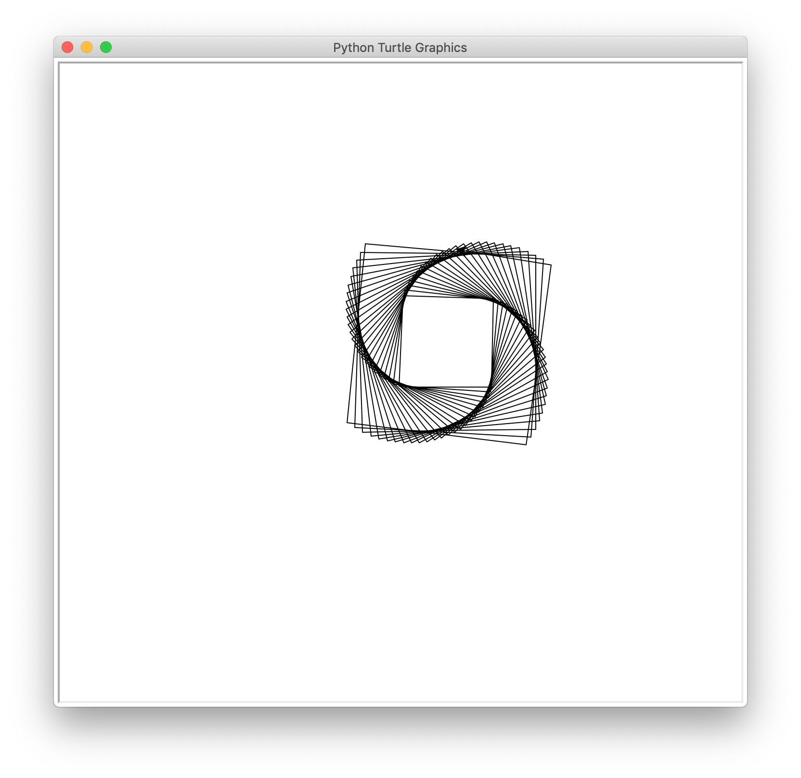

## Pre-requisitos

debes de tener python instalado, tanto como [tkinter](https://docs.python.org/2/library/tkinter.html), [turtle](https://docs.python.org/2/library/turtle.html) y [canvasvg](https://pypi.org/project/canvasvg/)

## Descargar e Instalar

si tienes git correr

```sh
$ git clone git@github.com:Infinity0106/DAXE.git
```

o ir descargar desde [aqui](https://github.com/Infinity0106/DAXE/archive/master.zip)

## Hello world

Crea un archio con extesion .dax y pegar el siguiente codigo

```cpp
programa "prueba";

dibujar(){
  var &turtle : entero;

  &turtle = 1;

  mientras(&turtle < 100){
    adelante 90;
    rotar 89;
    adelante 1+&turtle;
    &turtle = &turtle+1;
  }
}
```

## Tu primera corrida

si tienes distribucion macOS corre

```sh
$ ./dist/daxe <FILENAME>.dax
```

en caso contrario tienes python 2.7 instalado
correr (dentro del directorio de descarga)

```sh
$ python main.py <FILENAME>.dax
```

o para poder crear un binario para tu sistema operativo
tendiras que tener python e installar

```sh
$ pip install pyinstaller
```

y depsues correr

```sh
$ pyinstaller --onefile ./main.spec
```

esto generar un binario en la carpeta dist y un binario daxe

## Salida

WUALA


